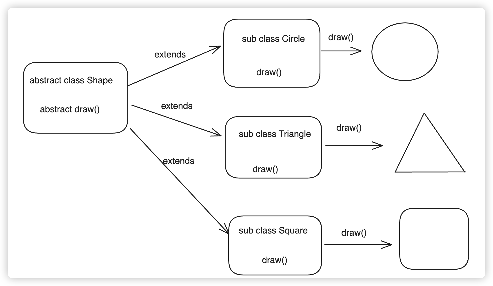

## 抽象类

面向对象中还有一个概念：**抽象类**。抽象类是对类结构与方法的抽象。

**面向对象的三大特征: 封装 继承 多态**

关于后端语言对于多态的理解：

多态是同一个行为具有多个不同表现形式或形态的能力

### 多态存在的三个必要条件

- 继承
- 重写
- 父类引用指向子类对象：**Parent p = new Child();**



后端java伪代码实现：

```typescript
abstract class Shape{
  abstract void draw();
}
class Circle extends Shape{
  void draw(){
    System.out.println("Circle")
  }
}

class Triangle extends Shape{
  void draw(){
    System.out.println("Triangle")
  }
}

class Square extends Shape{
  void draw(){
    System.out.println("Square")
  }
}

// 后端的多态
// 继承
// 重写
// 父类引用指向子类对象
Shape s = new Square();
s.draw();
```

### TS中抽象类的语法


```typescript
abstract class Foo {
  abstract name: string;
  abstract get nameGetter(): string;
  abstract method(name: string): string;
  static info(): void {
    console.log('Foo Info');
  }
}
```

注意，抽象类中的成员也需要使用 `abstract` 关键字才能被视为抽象类成员，反过来，如果一个类中有`abstract`修饰成员，那么必须在抽象类中

如果抽象类中全部是抽象成员，抽象方法或者静态方法，子类可以使用`implements`实现，当然也可以使用`extends`

```typescript
class Baz implements Foo {
  name = 'baz';
  get nameGetter(): string {
    return this.name;
  }
  method(name: string): string {
    return name;
  }
}
```

当然最关键的，**抽象类并不能被实例化**，抽象类出现的目的就是为了程序架构而生的，抽象类中全部都是抽象的方法，所以也没有实例化的必要。

```typescript
const f = new Foo(); // error 无法创建抽象类实例
```


如果抽象方法中，有实例方法，那么子类必须要使用`extends`继承

```typescript
abstract class Foo {
  abstract name: string;
  abstract get nameGetter(): string;
  abstract method(name: string): string
  static info(): void {
    console.log('Foo Info');
  }
  foo() { 
    console.log('foo')
  }
}

class Baz extends Foo {
  name = 'baz';
  get nameGetter(): string {
    return this.name;
  }
  method(name: string): string {
    return name;
  }
}
const baz = new Baz();
const b = baz.method("hello");
console.log(b)
baz.foo();
```

其实道理很简单，当抽象类中编译之后其实在js（ES6）中还是一个普通的class类，全是抽象的，其实相当于什么都没有，这个实现关系只存在于TS中，所以使用`implements`还是`extends`都没有关系，对编译之后的js文件都没有影响。

但是如果抽象类中有具体的方法了，编译之后的js文件的class类中是有内容的，所以必须要使用`extends`

如果一个类中，并没有全部实现抽象类的抽象方法，那么这个类也必须是抽象的。

```typescript
abstract class Foo {
  abstract name: string;
  abstract get nameGetter(): string;
  abstract method(name: string): string;
  static info(): void {
    console.log('Foo Info');
  }
}

abstract class Baz extends Foo {
  // name = 'baz';
  // get nameGetter(): string {
  //   return this.name;
  // }
  method(name: string): string {
    return name;
  }
}

class bar extends Baz {
  name = 'bar';
  get nameGetter(): string {
    return this.name;
  }
  method(name: string): string {
    return name;
  }
}
```

