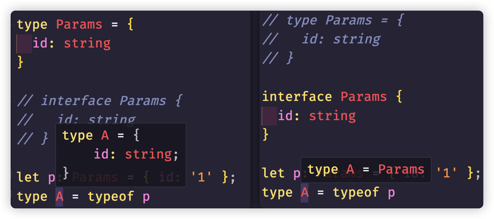
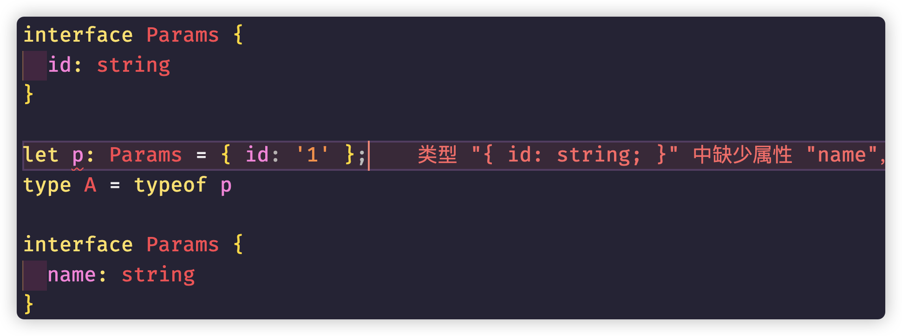

## 接口与类型别名的区别

这是一道在笔面试中经常出现的TS问题。当然你可以像背八股文一样，如下面这样回答：

- 在对象结构扩展情况下，interface 使用 extends 关键字，而 type 使用交叉类型（`&`）。
- 同名的 interface 会声明合并，当然需要兼容原接口的结构。
- interface 与 type 都可以描述对象类型、函数类型、Class 类型，但 interface 无法像 type 那样表达基本数据类型、元组、联合类型等等。

关于这个问题，最好从基本的面向对象的区分来入手回答才能更加形象具体

首先，接口本来就是面向对象中出现的名字，其目的就是对事务或者行为抽象的总结提取。因此，接口本来就是用来描述某一个结构的。所以对于对象结构的扩展，**接口使用的是`extends`专属于面向对象的关键字**。而类型别名仅仅代码一个字面量的别名而已。和面向对象是没有任何实际意义上的关联的，**类型别名只是人为的使用了交叉运算符`&`来模拟了继承的关系，实现对象结构扩展**

其次，接口是面向对象的处理，因此在接口中，我们只能使用结构类型。而类型别名可以是任何类型，可以是基础类型，可以是函数，对象结构， **接口 无法像 类型别名 直接那样表达基础类型和元祖类型**

正是由于面向对象，对于**接口的声明就应该是抽象的描述，而不应该有复杂的类型逻辑运算，因此接口不能表达联合类型(交叉类型可以通过继承实现)，也不应该在接口中去处理类型逻辑**。类型别名则没有这些烦恼，因此如果要做**类型运算首选的当然是类型别名**

**面向对象是对结构的设计，因此对于架构的考虑，接口可能需要对外公布的，所以接口有声明合并的特性**。如果我们设计第三方库，有些类型需要考虑到使用者是否需要扩展，那么我们可以声明成接口。当然，如果不需要的话，直接就是类型别名了

### 接口与索引签名(映射)所引发的问题

但是接口的声明合并会引发一个可大可小的问题，稍微不注意，会给我们开发留下坑，要说明这个问题，我们一层层的来剖析，首先看下面的问题：

```typescript
type Params = {   
  id: string
}

// interface Params { 
//   id: string
// }

let p: Params = { id: '1' };
type A = typeof p
```

当时**类型别名Params**的时候，`type A = typeof p`能够很清楚的看到，类型就是字面量`{id:'1'}`，但是当换成**接口Params**的时候，`type A = typeof p`只能看到类型是Params类型，大家有没有思考过这个问题呢？



这是因为，设置类型别名之后，VSCode知道当前的类型是固定的，不会再进行改变，而interface由于有声明合并的存在，并不能确定最后的接口内到底有什么内容，所以仅仅只是显示了接口名而已。

如果我们下面添加一个同名接口，就会出现问题。



接下来看索引签名的一个问题：

```typescript
type MyRecord = { 
  [key: string]: string
  age: number // 报错 类型number的属性age不能赋值string索引类型string
}
```

因为索引签名已经规定了，键是string类型，值是string类型，下面我们要自定义自己的键值和上面规定的就不匹配了

所以，像这样的写法就错误了：

```typescript
type MyRecord = { 
  [key: string]: string
}

const record: MyRecord = {
  name: "jack",
  type: "admin",
  sex: "男",
  age: 20 // error
}
```

`record`前面属性键值都是匹配的，但是`age`不匹配，所以报错。

上面两个问题都搞清楚之后，下面的问题就好解决了：

```typescript
interface MyInterface { 
  name: string
}
type MyType = {
  name: string
}

const example1: MyType = { name: 'example2'}
const example2: MyInterface = { name: 'example1' }


interface MyRecord { 
  [key: string]: string
}

let record: MyRecord = {}
record = example1;
record = example2; // error
```

上面`MyInterface`和`MyType`明明一模一样，`example1`与`example2`的值也差不多。但是当`example2`赋值给`record`的时候，却报错了。

原因其实就是TS不能根据自己的类型推导，确定类型签名与接口的值是匹配的，因为接口存在声明合并的情况，而且索引签名也存在如果出现和索引键值不匹配的情况会报错。

当然这是一个很简单的情况，有时候在不经意之间出现了这个问题，确实有点找不到原因所在，比如有下面的函数:

```typescript
function useParams<ParamsOrKey extends string | Record<string, string | undefined>>() { }
useParams<MyType>()
```

`Record<string, string | undefined>`这个写法希望大家没有忘记，TS的工具函数，和下面这样写的意思是一样的：

```typescript
{
  [key:string]：string|undefined
}
```

不用管这个函数的泛型参数写的有点复杂，就是简单复刻了`react-router`路由的`useParams`钩子函数，其实就是接受一个字符串，或者索引类型的键值对。

当然泛型是上面的MyType类型别名的时候没有任何问题，但是如果是接口，直接报错：

```typescript
function useParams<ParamsOrKey extends string | Record<string, string | undefined>>() { }
// 错误： 类型“MyInterface”不满足约束“string | Record<string, string | undefined>”。
useParams<MyInterface>() 
```

如果你不知道上面的一些问题，这个错误够你找一天。